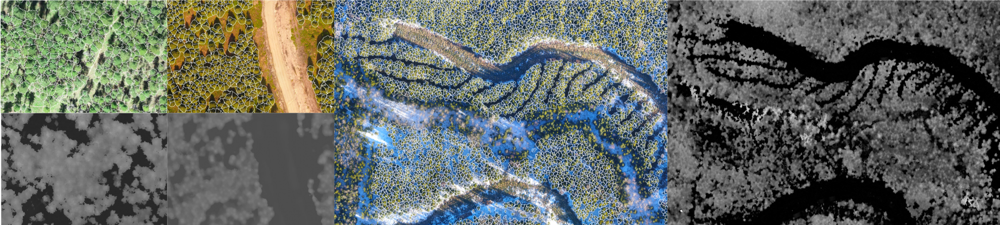

# Dense Canopy Tree Crown Instance Segmentation

<div align="center">
  
</div>

## Framework Structure
* `configs/` - definition of config files, which defines architecture, pretrained model to load, hyperparameters...
* `lib/` - libraries and dependencies
* `deepent/` - our library
    * `data` - module for data pre-processing and processing for training and evaluation
    * `modelling` - model architectures
* `output/` - files generated by framework such as models, logs, summaries, checkpoints ...
* `notebooks/` - documentation logbooks
* `setup` - setup script
* `tools/` - tools
    * `train_net.py` - training and evaluation script
    * `vis.py` - a tool for creating visualizations
    * `legacy_logger.py` - posterior logging to wandb
    * `wandb_writer.py` - log metrics to wandb
    * `predictor.py` - custom predictor to handle RGBD data
* `MODEL_ZOO.md` - a summary of models
* `wandb` store wandb logs

## Environments

### AWS
If using AWS, we recommend an EC2 g4dn.xlarge instance.

Remember to load the pytorch build:
```
source activate pytorch_p36
```
### Other
- Linux or macOS with Python ≥ 3.6

### Setup

1. Clone repo:
```
git clone https://github.com/roeetal/drone-tree-id.git
```
2. run setup script:
```
cd drone-tree-id
chmod +x setup
./setup
```

## Training

To train the model, run the training script with appropriate flags:

* `--data_path`: path to data to register
* `--run_name`: name logs run for wandb
* `--no_log`: only specify if no logging is needed
* `--config-file`: the config file to load
Any additional arguments are passed as `opts` to override the config
* `OUTPUT_DIR`: the output path directory, for example: output/<name of experiment>

For example:
```
python tools/train_net.py --data_path ~/RGBD-Training-Data/ --run_name "fuse35" --config-file configs/deepent_fuse_rcnn_R_50_FPN.yaml OUTPUT_DIR output/fuse35
```
To run the process in the background so exiting a shell will not terminate training:
```
nohup <CMD> &
```

## Evaluation

To evaluation the model, run the training script with appropriate flags:
* `--eval-only`
* `--config-file`: the config file to load
* `MODEL.WEIGHTS`: the weight file to load
For example:
```
python tools/train_net.py --config-file /home/ubuntu/drone-tree-id/configs/deepent_rcnn_R_50_FPN.yaml --eval-only MODEL.WEIGHTS /home/ubuntu/drone-tree-id/output/model_0034999.pth
```

## Visualization

To create visualizations of a model inference use the `tools/vis.py` cli tool.
For more information about the arguments run:

```
python tools/vis.py --help
```

An example of visualization 5 2x12 infrence plots on the 'CPT2b_test' dataset would be 

```
python tools/vis.py --threshold 0.5 --config-file configs/deepent_fuse_rcnn_R_50_FPN.yaml --samples 5 --output output/fuse_lateral/vis --type comparison --dataset CPT2b_test --model output/fuse_lateral/model_final.pth --data_path ~/RGBD-Tree-Segs-Clean/ --type many
```

To transfer from AWS to your local machine, use SCP

```
scp -r -i path/to/ssh_key ubuntu@ip-address:/path/to/saved/visualizations path/to/transfer
```

## Inference 

```shell script
python segment_trees.py 
--data 'path to my dataset(s)' # if empty will look at the tiles path
--plots ['CPT*', 'Twister', 'Kelowna'] # if empty will
--predictors ['alexis, sequoia', 'andrew', 'sequoia']  # if empty will use a default setting 'fuse, mask'
--confidence 0.5
--duplicate-threshold 0.85
--min-segment-area 2
```

## Library Modifications:

The PyCOCOTools library has a python2/3 compatibility issue. See https://github.com/cocodataset/cocoapi/issues/49 for the fix.
pycocotools python3 unicode issue
Alter line 308 of coco.py at pycocotools library directory, change `unicode` to `bytes`.


When loading pretrain ResNet weights into a depth model, the checkpoint loader loads the suffix of matching weights between two models with the longest name (e.g. backbone.res2 vs backbone.depth_encoder.res2). This convention is not kept in depth based resnet backbones, so we manyally remove the depth-encoder matches before loading in new weights. 
See the TODO edit in `/home/ubuntu/drone-tree-id/lib/detectron2/detectron2/checkpoint/c2_model_loading.py`
